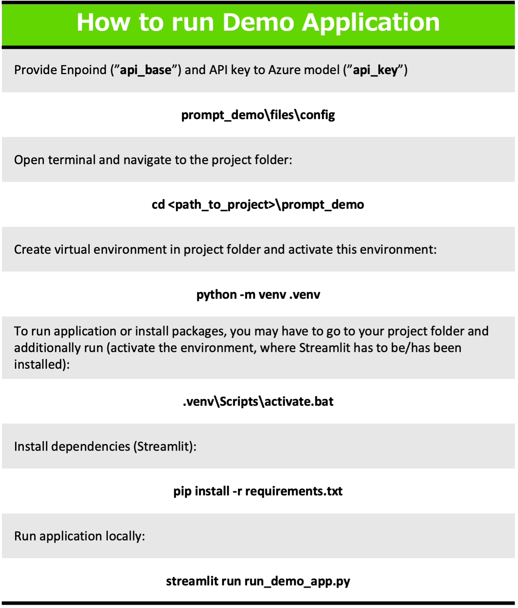

# 生成AIのプロンプト改善システム

このシステムは、LLMにより入力プロンプトを改善することができる。そして、様々なLLM(GPT,Llama2など)に対応可能である。

## 基本コンセプト

下の画像のように、LLMを使ってユーザーからのプロンプトを改善している。また、出力されたヒントはユーザ自身で修正することができる。そして、この修正されたヒントにより、ユーザはより改善されたプロンプトを得ることができる。

## Demo UI

## Install

