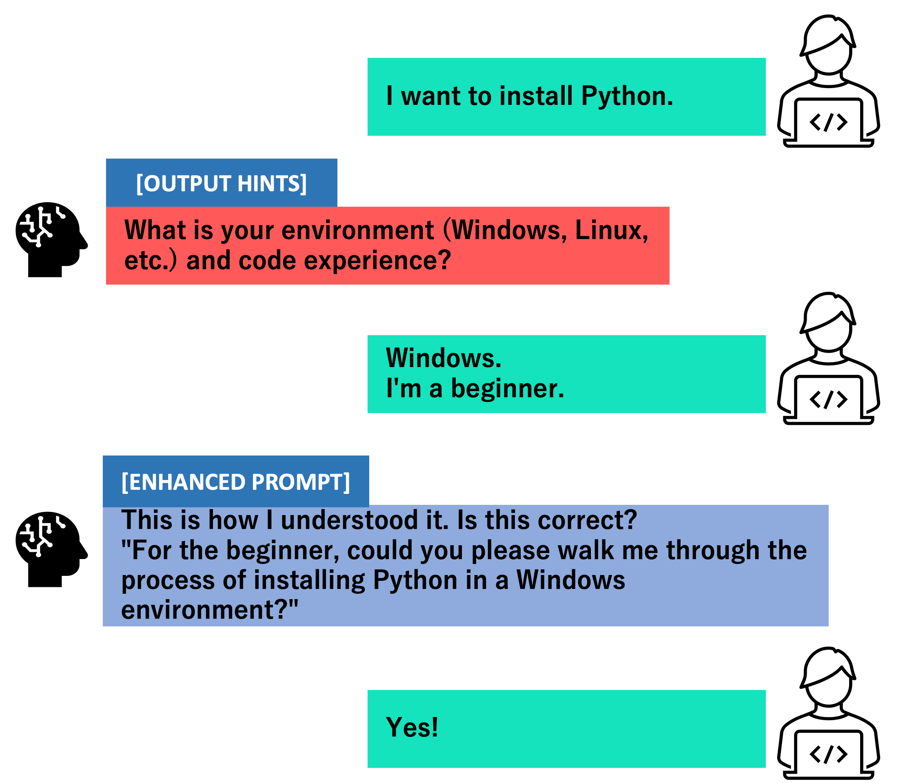

# 日本語は→[こちら](README(日本語).md)　　
# Prompt Improvement System

This system which can improve the input prompt by LLM. And it can be used with variety of LLMs(such as GPT,Llama2...).

## Basic Concept

Like the image in the below, We have used the LLMs to improve the prompt from user. And user can revise the output hints by themselves. And whith these revised hints user can get the enhanced prompt.

## Demo UI

